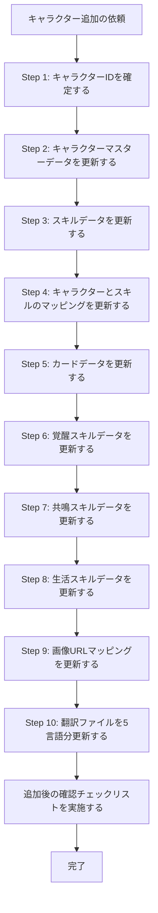

# 新規キャラクター追加スキル

## 概要

新規キャラクターを追加する際は、**複数のファイルをセットで更新しなければならない**。1ファイルでも漏れると、デッキビルダーでデータ不整合が発生する。

過去のPRで繰り返し発生したミスをもとに、このスキルを作成した。

---

## 更新が必要なファイル一覧

### 必須ファイル（すべて更新すること）

| ファイル | 役割 |
|---------|------|
| `lib/charDb.ts` | キャラクターのマスターデータ（ステータス・スキル・共鳴スキル・覚醒スキルリスト） |
| `lib/skillDb.ts` | スキルデータ |
| `lib/charSkillMap.ts` | キャラクター↔スキルのマッピング |
| `lib/cardDb.ts` | カードデータ |
| `lib/breakDb.ts` | 覚醒スキルデータ（6件） |
| `lib/talentDb.ts` | 共鳴スキルデータ（5件） |
| `lib/homeSkillDb.ts` | 生活スキルデータ |
| `lib/imgDb.ts` | 画像URLマッピング |
| `messages/jp.json` | 日本語テキスト（最低限必須） |
| `messages/en.json` | 英語テキスト |
| `messages/ko.json` | 韓国語テキスト |
| `messages/cn.json` | 中国語（簡体字）テキスト |
| `messages/tw.json` | 中国語（繁体字）テキスト |

---

## Workflow

## Step 1: キャラクターIDを確定する

追加するキャラクターのIDを確認する。IDは `10001XXX` 形式の整数。

> ⚠️ **よくあるミス（PR #36 の事例）**: IDを間違えて登録し、後から全ファイルを修正する事態が発生した。  
> **対策**: IDを最初に確定し、以降の全ファイルで必ず同じIDを使用すること。

## Step 2: キャラクターマスターデータを更新する

キャラクターのマスターデータを `lib/charDb.ts` に追加する。
詳細は、[char-db.md](./references/char-db.md) を参照。

**重要な注意点:**
- `hp_SN`, `atk_SN`, `def_SN` などの `_SN` フィールドは**実際の値 × 1,000,000**の整数
- `breakthroughList` は**6件**。**先頭（index 0）は必ず属性なしの「基本突破」**（PR #50 の教訓）
- `talentList` は**必ず5件**

## Step 3: スキルデータを更新する

スキルデータを`lib/skillDb.ts` に追加する。
詳細は、[skill-db.md](./references/skill-db.md) を参照。

> ⚠️ **よくあるミス（PR #56 の事例）**: リーダースキル条件付きスキルで `leaderCardConditionDesc` フィールドを書き忘れた（汎用キー `"skill.leaderCardConditionDesc"` を使ってしまった）。  
> **対策**: リーダースキル条件があるスキルは必ず `"skill.{skillId}.leaderCardConditionDesc"` 形式のキーを使うこと。

## Step 4: キャラクターとスキルのマッピングを更新する

キャラクターとスキルのマッピングを`lib/charSkillMap.ts` に追加する。
詳細は、[char-skill-map.md](./references/char-skill-map.md) を参照。

> ⚠️ **重要**: `skills[]` の内容が `charDb.ts` の `skillList[].skillId` と**完全一致**していることを確認する。

## Step 5: カードデータを更新する

カードデータを`lib/cardDb.ts` に追加する。
詳細は、[card-db.md](./references/card-db.md) を参照。

## Step 6: 覚醒スキルデータを更新する

覚醒スキルデータを`lib/breakDb.ts`に6件追加する。
詳細は、[break-db.md](./references/break-db.md) を参照。

> ⚠️ **よくあるミス（PR #50 の事例）**: `breakthroughList` の先頭に属性付きの突破を置いてしまった。  
> **対策**: 先頭は必ず `attributeList: []` の基本突破。charDb.ts の `breakthroughList[0]` のIDが `breakDb.ts` で `attributeList: []` になっていることを確認する。

## Step 7: 共鳴スキルデータを更新する

共鳴スキルデータを`lib/talentDb.ts` に**5件**追加する。
詳細は、[talent-db.md](./references/talent-db.md) を参照。

> ⚠️ **よくあるミス（PR #42 の事例）**: 別キャラクターのタレントデータ5件を誤ってコピーし、不要なデータ（ID範囲外のタレント）を `messages/jp.json` に追加してしまった。  
> **対策**: `charDb.ts` の `talentList` に含まれる**5件のみ**追加する。それ以外のタレントIDは絶対に追加しない。

## Step 8: 生活スキルデータを更新する

生活スキルを`lib/homeSkillDb.ts` に追加する（通常3件）。
詳細は、[home-skill-db.md](./references/home-skill-db.md) を参照。

## Step 9: 画像URLマッピングを更新する

画像URLマッピングを`lib/imgDb.ts` に追加する。
詳細は、[img-db.md](./references/img-db.md) を参照。

> ⚠️ **よくあるミス（PR #42 の事例）**: `charDb.ts` の `talentList` に含まれる5件を超えた余分なタレント画像を追加してしまった。  
> **対策**: タレント画像は `charDb.ts` の `talentList` の**5件分のみ**追加する。

## Step 10: 翻訳ファイルを5言語すべて更新する

`messages/jp.json`, `messages/en.json`, `messages/ko.json`, `messages/cn.json`, `messages/tw.json` の**5ファイル全て**を必ずセットで更新する。

### `messages/jp.json` のセクション別更新内容

詳細は、[messages-json.md](./references/messages-json.md) を参照。

> ⚠️ **よくあるミス（PR #42 の事例）**: タレントデータを `talent` セクションではなく `skill` セクションに入れてしまった、または `charDb.ts` に含まれないIDのタレントを追加してしまった。  
> **対策**: 各データを正しいセクションに配置し、IDが `charDb.ts` の各リストと一致することを確認する。

---

## 追加後の確認チェックリスト

追加が完了したら、以下の項目を必ず確認すること。

### ID整合性チェック

- [ ] `charDb.ts` のキャラクターID（`"10001XXX"`）が全ファイルで一致している
  - `charDb.ts`: `"id": 10001XXX`
  - `charSkillMap.ts`: キー `"10001XXX"`
  - `imgDb.ts`: `"char_10001XXX"`
  - `messages/*.json`: `"char"."10001XXX"`
- [ ] `charDb.ts` の `skillList[].skillId` が `charSkillMap.ts` の `skills[]` と完全一致している
- [ ] `charDb.ts` の `talentList[].talentId` が `talentDb.ts` のキーと一致している（5件）
- [ ] `charDb.ts` の `breakthroughList[].breakthroughId` が `breakDb.ts` のキーと一致している（6件）

### 覚醒スキルチェック

- [ ] `charDb.ts` の `breakthroughList[0]`（先頭）のIDが `breakDb.ts` で `"attributeList": []` である

### 共鳴スキルチェック

- [ ] `talentDb.ts` に追加した共鳴スキルが `charDb.ts` の `talentList` の5件と対応している（余分なものを追加していない）
- [ ] `imgDb.ts` に追加した共鳴スキル画像が5件のみである（余分なものを追加していない）

### スキルデータチェック

- [ ] リーダーカード条件付きスキルの `leaderCardConditionDesc` が `"skill.{skillId}.leaderCardConditionDesc"` 形式のキーになっている（汎用キー `"skill.leaderCardConditionDesc"` を使っていない）

### メッセージファイルチェック

- [ ] `messages/` の5言語ファイル（jp / en / ko / cn / tw）全てを更新した
- [ ] 各セクション（char / skill / talent / card / home_skill）に正しいIDでデータを配置した

### ファイル漏れチェック

- [ ] `lib/charDb.ts` ✅
- [ ] `lib/breakDb.ts` ✅
- [ ] `lib/cardDb.ts` ✅
- [ ] `lib/charSkillMap.ts` ✅
- [ ] `lib/skillDb.ts` ✅
- [ ] `lib/talentDb.ts` ✅
- [ ] `lib/homeSkillDb.ts` ✅（データが存在する場合）
- [ ] `lib/imgDb.ts` ✅
- [ ] `messages/jp.json` ✅
- [ ] `messages/en.json` ✅
- [ ] `messages/ko.json` ✅
- [ ] `messages/cn.json` ✅
- [ ] `messages/tw.json` ✅

---

## よくあるミスまとめ

| ミスのパターン | 発生したPR | 影響 | 回避策 |
|--------------|-----------|------|--------|
| キャラクターIDを間違えた | PR #36 | 全ファイルで修正が必要 | IDを最初に確定し、全ファイルで統一する |
| `breakthroughList` の先頭が基本突破でない | PR #50 | 突破表示の順序異常 | 先頭要素の `attributeList` が `[]` であることを確認 |
| 不要なタレントデータをコピーした | PR #42 | 不正なデータが表示される | `charDb.ts` の `talentList` 5件のみを対象にする |
| `leaderCardConditionDesc` を書き忘れた | PR #56 | スキル条件が表示されない | リーダーカード条件付きスキルは必ずキーを追加する |
| `messages/` のファイルを一部だけ更新した | 複数PR | 他言語で表示されない | 5言語ファイルを必ずセットで更新する |

---

## データ仕様リファレンス

データ仕様の詳細は、[data-specification.md](./references/data-specification.md) を参照する。
