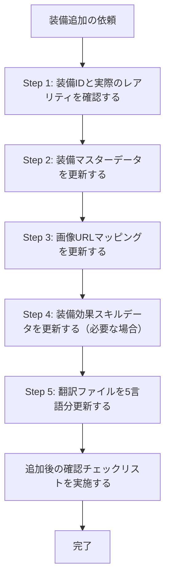

# 新規装備追加スキル

## 概要

新規装備を追加する際は、**複数のファイルをセットで更新しなければならない**。1ファイルでも漏れる、
または `quality`（レアリティ）や画像URLを誤ると、デッキビルダーで表示不整合が発生する。

Issue #128（「緋雷の律」の `quality` 誤記・画像URL不備）をもとに、このスキルを作成した。

---

## 更新が必要なファイル一覧

### 必須ファイル（すべて更新すること）

| ファイル | 役割 |
|---------|------|
| `lib/equipDb.ts` | 装備のマスターデータ（`quality`, `equipTagId`, `skillList`, `Getway` 等） |
| `lib/imgDb.ts` | 装備の画像URLマッピング（`equip_{equipId}`） |
| `lib/skillDb.ts` | 装備効果スキルデータ（新規スキルを伴う場合のみ） |
| `messages/jp.json` | 日本語テキスト（最低限必須） |
| `messages/en.json` | 英語テキスト |
| `messages/ko.json` | 韓国語テキスト |
| `messages/cn.json` | 中国語（簡体字）テキスト |
| `messages/tw.json` | 中国語（繁体字）テキスト |

---

## Workflow

## Step 1: 装備IDと実際のレアリティを確認する

追加する装備のID（`118000XX` 形式）と、公式・攻略Wiki等で実際のレアリティ（UR/SSR/SR/R）を確認する。

> ⚠️ **よくあるミス（Issue #128 の事例）**: UR装備「緋雷の律」を、見た目の色（紫っぽい）から
> 感覚的に `quality: "Purple"`（SR相当）と誤記した。
> **対策**: レアリティは必ず一次情報（公式サイト・攻略Wiki）で確認し、
> [equip-db.md](./references/equip-db.md) の対応表で `quality` の値に変換すること。

## Step 2: 装備マスターデータを更新する

装備のマスターデータを `lib/equipDb.ts` に追加する。
詳細は、[equip-db.md](./references/equip-db.md) を参照。

**重要な注意点:**
- `quality` は `"Orange"=UR` / `"Golden"=SSR` / `"Purple"=SR` / `"Blue"=R` の対応（根拠となる実装は
  `hooks/deck-builder/useCharacterSlot.ts` の `getRarityColor`/`getRarityBorderStyle`）
- `equipTagId` は `12600155`/`12600160`=武器, `12600161`=防具, `12600162`=装身具

## Step 3: 画像URLマッピングを更新する

画像URLを `lib/imgDb.ts` の `equip_{equipId}` キーに追加する。
詳細は、[img-db.md](./references/img-db.md) を参照。

> ⚠️ **よくあるミス（Issue #128 の事例）**: PukiWikiの `?plugin=attach&pcmd=open&file=...&refer=img`
> 形式のURLを登録し、画像が表示されなかった。
> **対策**: 登録前に必ずブラウザで実URLを開いて画像が表示されることを確認し、
> `attach2/` 形式など直接表示可能なURLを使うこと。

## Step 4: 装備効果スキルデータを更新する（必要な場合）

装備に固有の効果スキルがある場合、`lib/skillDb.ts` にスキルデータを追加する。
`equipDb.ts` の `skillList[].skillId` と一致するIDを使うこと。

## Step 5: 翻訳ファイルを5言語すべて更新する

`messages/jp.json`, `messages/en.json`, `messages/ko.json`, `messages/cn.json`, `messages/tw.json` の**5ファイル全て**を必ずセットで更新する。
詳細は、[messages-json.md](./references/messages-json.md) を参照。

---

## 追加後の確認チェックリスト

追加が完了したら、以下の項目を必ず確認すること。

### レアリティ・表示チェック

- [ ] `equipDb.ts` の `quality` が、実際のレアリティ（UR/SSR/SR/R）と一致している
      （`equip-db.md` の対応表で再確認する）
- [ ] `imgDb.ts` の画像URLをブラウザで開き、実際に画像が表示されることを確認した

### ID整合性チェック

- [ ] `equipDb.ts` の装備ID（`"118000XX"`）が全ファイルで一致している
  - `equipDb.ts`: `"id": 118000XX`
  - `imgDb.ts`: `"equip_118000XX"`
  - `messages/*.json`: `"equip"."118000XX"`
- [ ] `equipDb.ts` の `equipTagId` が装備種別（武器/防具/装身具）と一致している
- [ ] `equipDb.ts` の `skillList[].skillId` が `skillDb.ts` のキーと一致している（効果スキルがある場合）

### メッセージファイルチェック

- [ ] `messages/` の5言語ファイル（jp / en / ko / cn / tw）全てを更新した
- [ ] `equip` セクションに正しいIDでデータを配置した（`skill` セクションと混在させていない）

### ファイル漏れチェック

- [ ] `lib/equipDb.ts` ✅
- [ ] `lib/imgDb.ts` ✅
- [ ] `lib/skillDb.ts` ✅（効果スキルがある場合）
- [ ] `messages/jp.json` ✅
- [ ] `messages/en.json` ✅
- [ ] `messages/ko.json` ✅
- [ ] `messages/cn.json` ✅
- [ ] `messages/tw.json` ✅

---

## よくあるミスまとめ

| ミスのパターン | 発生したIssue/PR | 影響 | 回避策 |
|--------------|-----------|------|--------|
| `quality` を感覚的に決めて誤記した | Issue #128 | レアリティの表示が実際と異なる（UR装備がSRとして表示される等） | 一次情報でレアリティを確認し、`equip-db.md` の対応表で変換する |
| 画像URLがPukiWikiの添付プラグイン形式で表示不可だった | Issue #128 | 装備画像が表示されない | 登録前にブラウザで実URLを開いて確認し、直接表示可能なURLを使う |

---

## データ仕様リファレンス

データ仕様の詳細は、[data-specification.md](./references/data-specification.md) を参照する。
